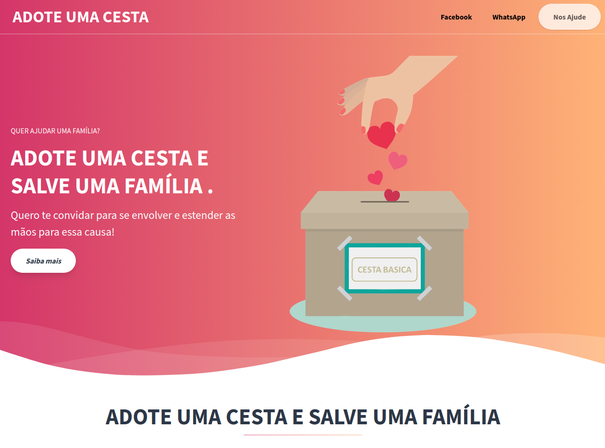

<h1 align="center">
  Toda doação é importante!
</h2>

    

 

## 💻 O Projeto
ADOTE UMA CESTA - Landing-Page desenvolvida para uma ação solidária de arrecadação de fundos para doação de Cestas Básicas para famílias carentes.  
**OBS:** Retirado os dados reais de contato.

## ☕ Funcionalidades
- Apresentação do projeto e dados para doação.

## :rocket: Tecnologias usadas
Este projeto foi desenvolvido com as seguintes tecnologias:
- :u7533: **HTML5**

## :page_with_curl: Qual a importância de doação?  
A doação é um gesto solidário, de doar uma pequena quantidade financeira para <b>salvar a vida de pessoas</b> que estão passando por momentos dificeis devido as complicação econômicas.

## :memo: Licença

Esse projeto está sob a licença MIT. Veja o arquivo [LICENSE](LICENSE.md) para mais detalhes.

---

Feito com ❤️ by Wellington Bernardes :wave: